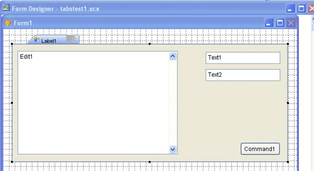
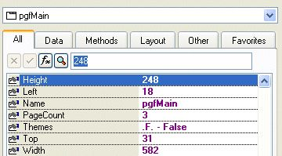
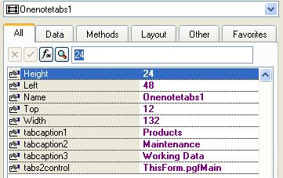
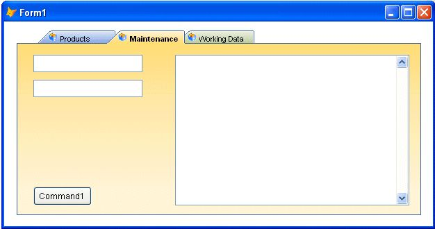

来自：http://weblogs.foxite.com/bernardbout/archive/2006/06/07/1704.aspx

翻译：xinjie

制作这样的标签，从技术上说是简单、直接的。既然我不使用 API ，为了达到渐变的效果，就需要一张图片，每种颜色需要一张。这里使用的技术是我自己的。也许有其他的方法，但我是这样做的。它只能在 VFP9 中工作，因为它使用了 MemberClass 属性。

正如我在上一篇中提到的，我的逻辑是仅仅在程序中设计需要的功能。我并不想出卖这个控件，所以我可以决定我在其中包含什么，而不包含什么。我决定在我的控件中最多使用8个标签，因为我从来没有在我的应用程序中使用超过8个的标签。同样，我并不想在其中实现复杂的滚动标签。所以，里面也不包含这些内容。

**第一步** 创建所需的图片及其掩码。我使用 Paint Shop Pro 来做渐变的效果，但是，你也可以使用其他任何可以做到这个效果的程序。

首先要创建一个兰色渐变的标签。在做完并保存后，我可以用其他我想使用的7种颜色来重新设计它，当然，这7种颜色都有对应的图片文件。最后，我针对每个位图文件创建它们的掩码（.msk）。

**下一步**，我创建一个2像素宽，600像素高的位图。其颜色渐变从最浓到最淡渐变。这可以看做是需要打开的附加文件。针对我所选择每种颜色我一共做了8个。最后我创建了一个很小的 15 x 15 的图片用于标签，并创建其对应的 msk 文件。

我现在有了8个梯形的标签，8个细长的渐变图片，1个很小的图片和17个 msk 文件。我已经准备好了。

我决定在我的类中使用 PageFrame 和 Pages ，因此我可以设置几个默认的属性，这些属性在 VFP 的 pageframe 中并不允许我设置。它们是：

    BorderColor

    BorderWidth

    SpecialEffect

我创建了一个 PAGE 类，通过设置我的自定义 PageFrame 类的 MemberClass 和 MemberClassLibrary ，以便于其中所使用的页面指向这个 PAGE 类，从而可用于我的 PAGEFRAME 类。

对于我的标签，它们将位于自定义 pageframe 类上面。由它们来做所有设置好的行为。pageframe 不会显示标签，我的标签将激活隐藏的 pageframe 中的 页面。

我做两件事情。第一，使用置于全部页框标签之上的一个不可见按钮，该按钮能通过 click() 捕获所有的交互操作。第二，通过设置Left=-100隐藏了虚拟命令按钮，从而摆脱了出现虚线矩形焦点。我留意到，鼠标响应按钮优于其他控件。

我使用这样的方法来检查最后的效果。通常我会打开一个新的表单，然后在其中创建我的对象，然后运行表单，看看它们的效果。这一次我也这么做。我创建了一个单独的按钮，然后通过拷贝它来创建其他的按钮。当我对结果感到满意时，我选择一个按钮，将其另存为我的自定义类。然后在类设计器中打开这个类并编辑它，增加所需要的方法和属性。

PRG 类有它的用武之地，但是当结果是可视的效果时，我就特别厌恶使用它。我更喜欢使用可视的类来工作，那样我就可以控制它的布局和尺寸。这就是我的思想。

为了得到我需要的效果——渐变——我使用了这样的技术：在 image 控件使用一个 2x600 的图片，设置 image 的 stretch =2 。小图片让我使用更少的资源来得到我想要的效果。

对于我这个类，我决定尽量的使其包含自身的控制。所以我创建了一个表单，将我的 自定义 PageFrame 类放上去，并且指定页面的数目。现在，它看上去很像 VFP 自身的 PageFrame 。将其他所需的对象放置在表单上。针对所有的意图和目的它都可以像 VFP 的 PageFrame 那样操作。我同样也设置了下面的 PageFrame 对象的属性：

然后我移动我的 ONT 类，并且使它们对齐，就像下图显示的这样：

接下来是自定义属性设置：

Tabcaption1、Tabcaption2 和 Tabcaption3 是将要显示在页面上的标题。我只所以设置3个，是因为下面的 PageFrame 的 PageCount 属性值为 3 。

Tab2control – PageFrame 对象的完整路径。

所有的一切都做完了。

当表单运行时，ONT 类就被取代并按照设置显示，结果就是下图所示：

下载附加文件和示例代码(译者注：在本文同目录下的 ZIP 文件)来看看这件事到底是如何做的。我非常希望你能提出一些意见。并记住，使用 VFP 几乎可以做到任何的事，如果你超越了思维的束缚，并使用一些小的技巧的话。

下一次我会在 VFP 中使用哪个控件呢？你可以猜一猜。

**12/06/2006**

Vladimir Martinovski  对类的原型做了一些改变。它的代码解决了矩形的焦点问题，但引出了其他的问题。你不能使用键盘来控制，因为他抛弃了不可见的按钮，而是在其中使用了一个 shape 。要检验他的修改版本，你可以下载 **bbonenotetabs_changed.zip 。（译者注：原文未提供该文件的下载链接）**

**2006年11月4日，我找到一个使用 OneNoteTabs 做的应用程序。它真的很酷！**

发表于 2006年6月7日，星期三，2:23 PM

作者：bbout  

译者注：这一篇翻译的很不成功，看起来有些晦涩。而且，由于所得到的文件似乎和作者的表述有一些出入，所以，如果哪里不明白，还是以源代码为准。
