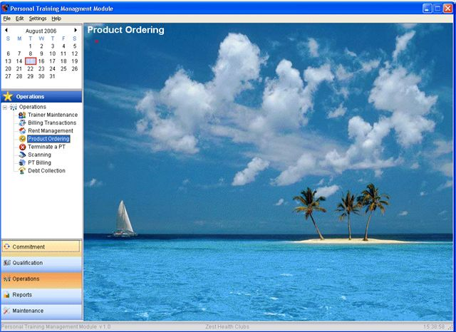
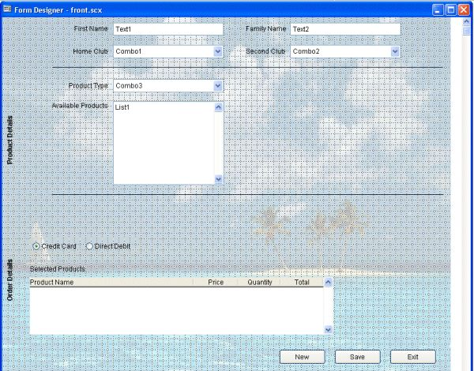
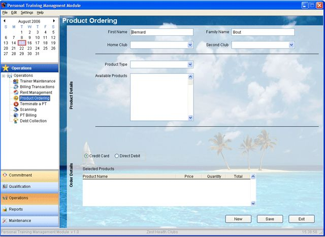
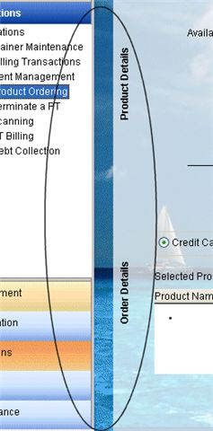

# Transparent Forms in Visual FoxPro Revealed

来自：http://weblogs.foxite.com/bernardbout/archive/2006/08/27/2353.aspx

翻译：xinjie

**它是如何做到的**

我在前面的文章中我故意的含混了一些，因为我想激起一些人的兴趣。前面的方法可以很容易的实现所需要的结果，但是这里的，应该更奇妙。

许多读者会体会到，它仅仅是是使用了一个 SKIN ，其他没做什么。

无论如何，我在这篇里描述一个实现半透明表单的方法。我希望读者思考并在自己的工作中应用它。

主表单是一个利用我自己的“Outlook”导航类的的 SDI 表单。主要是通过点击淡蓝色的按钮来填充可在界面上使用的一个 tree 。点击其中一个节点可以在右侧打开一个窗口并用于实际操作。迄今为止这已经是一种标准。SDI 表单具有一个很大的图片作为它的背景。

(点击图片看大图)



图中“Product Ordering”下可以看到一个红色的“**X**”，**它**通常情况下的设置是 Visible = .F. ，这是我的一个标记。

对于子表单，我创建了一个表单类，并且所有的子表单都继承自这个表单类。这个表单类通常设置是 **TitleBar = 0** 和 **BorderStyle = 0** （无边框）。我然后调整它到无需要的大小。

我在打开的大背景图片中拷贝从红色的“**X**”至图片底部的区域。这样我就得到一个较小的主图片。我对其应用一个白色的滤镜，调整其透明度，就像做一个文字的水印一样。直到得到下面的效果。


我将这个图片作为我的表单类的背景。我手工调整表单的大小直到正好容纳下图象。这样，我就得到了一个可以用于所有表单的表单类。这里是其中一个子表单的设计时刻的截图。



每个子表单都利用这个类来创建，并在其中增加代码。树中每个节点的 Click 事件都打开一个应用表单。

在表单类的 INI 事件中我增加了这些代码：
```foxpro
LPARAMETERS toForm

With ThisForm
    * LabelX 是红色“X”标签的对象名
    .Top = toForm.LabelX.Top
    .Left = toForm.LabelX.Left
ENDWITH
```
在 Treeview 项目中的 Click 像这样来调用合适的表单：
```foxpro
DO Form MyChildForm With ThisForm NOSHOW

SHOW Window MyChildForm IN WINDOW Mainform
```
利用上面的代码，子表单可以显示在适当的位置，并且在主表单移动时也会随之移动。显而易见的，调整表单大小是不允许的。在测试阶段，我会轻微的调整红色的“X”以便图象可以准确的对应。

最终的效果就是下面的截图。我故意在子表单左边留下一个比较宽的边框，以便更明显的显示出效果。



这个是放大后的表单边缘的效果：



这样就好象子表单是透明的，并且可以通过它看到主表单的背景。而控件是不透明的。这个效果在 windows XP 下不能实现。它仅仅在 Vista 下利用新的 API 才可以实现。

**幻象结束了。**

伟大的 Fox！

[这里有其他相似效果的表单截图。](http://www.foxite.com/archives/seethrough-form-0000105324.htm)

发表于2006年8月27日，星期日，2:15 PM
作者：bbout
